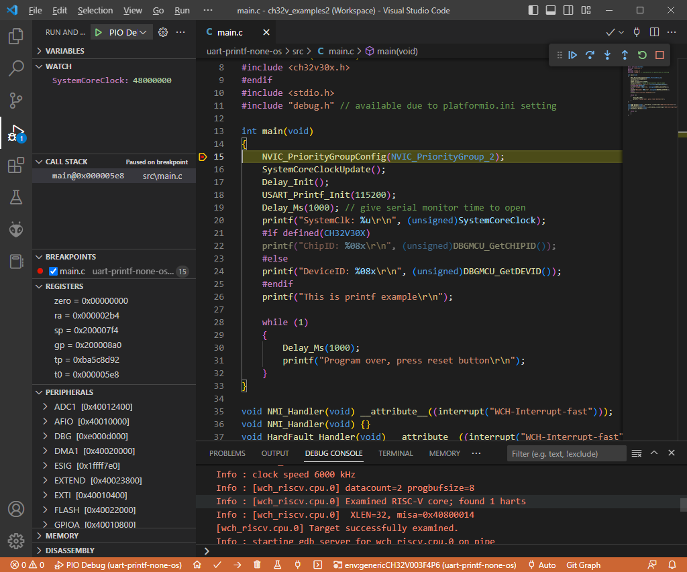
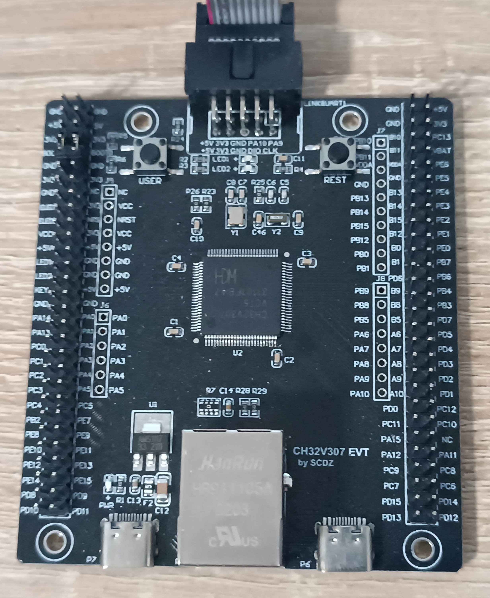

# CH32V: development platform for [PlatformIO](https://platformio.org)

[](https://github.com/Community-PIO-CH32V/platform-ch32v/actions) [](https://pio-ch32v.readthedocs.io/en/latest/?badge=latest)

The CH32V series offers industrial-grade, general-purpose microcontrollers based on a range of QingKe 32-bit RISC-V cores. All devices feature a DMA and a hardware stack area, which greatly improves interrupt latency. The family ranges from ultra-cheap, low-end CH32V003 with 2kB RAM / 16kB flash, up to high speed, ultra-connected CH32V307 with 64kB RAM / 256kB flash, hardware FPU, USB, CAN, Ethernet, etc.. For a list of available devices see the [CH32V product selector](http://www.wch-ic.com/products/categories/47.html?pid=5) page.

Note: [WCH](http://www.wch-ic.com) also offers the CH32**F** family with identical peripherals, which is based on ARM Cortex-M.

This repository is a PlatformIO platform. Just like [platform-ststm32](https://github.com/platformio/platform-ststm32/) etc., it enables the PlatformIO core to work with W.CH CH32V chips. This means in all the IDEs that PlatformIO supports ([VSCode, CLion, etc.](https://docs.platformio.org/en/latest/integration/ide/index.html)), developing and debugging firmwares for CH32V chips is easily possible.

Head over to https://github.com/Community-PIO-CH32V/ch32-pio-projects to see more example projects and detailed starting instructions.

# Documentation

Please visit https://pio-ch32v.readthedocs.io/ for the most recent documention.

**This page is a work in progress at the moment.**

# Important notices

The newest used version of OpenOCD **requires** the firmware of the WCH-Link(E) probe to be the latest (2.10 and 2.11 respectively). Otherwise you **will** be seeing flash programming errors like

```
Info : WCH-LinkE  mode:RV version 2.9 
..
** Programming Started **
Info : device id = 0xabc8abcd
Error: error writing to flash at address 0x00000000 at offset 0x00000000
embedded:startup.tcl:1162: Error: ** Programming Failed **
```

Please update the WCH-Link(E) firmware using
* https://www.wch.cn/downloads/WCH-LinkUtility_ZIP.html (Windows only, Target --> Query Chip Info)
* http://www.mounriver.com/download (MounRiver Studio, Windows and Linux Eclipse GUI)

If you use Mac, the usage of a Linux virtual machine may be required to run these tools.

# Media



# Support
- chips
    - [x] CH32V003 (QingKe V2A)
    - [x] CH32V103 (QingKe V3A)
    - [x] CH32V203 (QingKe V4B)
    - [x] CH32V208 (QingKe V4C)
    - [x] CH32V303 (QingKe V4F)
    - [x] CH32V305 (QingKe V4F)
    - [x] CH32V307 (QingKe V4F)
    - [x] CH32X035 (QingKe V4C)
    - [x] CH32L103 (QingKe V4C)
    - [x] CH56x (QingKe V3A)
    - [x] CH57x (QingKe V3A)
    - [x] CH58x (QingKe V4A)
    - [x] CH59x (QingKe V4C)
- development boards
    - [x] CH32V003F4P6-EVT-R0 (official by W.CH)
    - [x] CH32V203C8T6-EVT-R0 (official by W.CH)
    - [x] CH32V307 EVT (by SCDZ, close to official W.CH board)
    - [x] CH32X035C8T6-EVT-R0, CH32X035G8U6-EVT-R0, CH32X035F8U6-EVT-R0 (official by W.CH)
    - [x] CH32L103C8T6-EVT-R0 (official by W.CH)
- frameworks
    - [x] None OS ("Simple Peripheral Library" / native SDK)
    - [ ] Arduino
      - [x] for CH32V003 ([thanks to arduino-wch32v003](https://github.com/AlexanderMandera/arduino-wch32v003))
      - [x] for CH32V003, CH32V10x, CH32V20x, CH32V30x, CH32X035, CH32L103 ([thanks to openwch/arduino_core_ch32](https://github.com/openwch/arduino_core_ch32/))
      - [ ] for all else
    - [x] ch32v003fun by CNLohr
    - [x] FreeRTOS
    - [x] (Huawei) Harmony LiteOS
    - [x] RT-Thread
    - [x] TencentOS Lite-M
- debuggers (also implicitly uploaders)
    - [x] WCH-Link(E)
    - [ ] ST-Link
    - [ ] J-Link
    - [ ] GDB-UART stub for debug-probe-less debugging?
- uploaders (no debugging)
  - [x] USB ISP bootloader (supported via [wchisp](https://github.com/ch32-rs/wchisp))
# Installation (see [docs](https://pio-ch32v.readthedocs.io/en/latest/installation.html))

1. [Install PlatformIO](https://platformio.org)
2. Install platform-ch32v via [PIO Core CLI](https://docs.platformio.org/en/latest/integration/ide/vscode.html#platformio-core-cli) --> `pio pkg install -g -p https://github.com/Community-PIO-CH32V/platform-ch32v.git`
3. Create PlatformIO project and configure a platform option in [platformio.ini](https://docs.platformio.org/page/projectconf.html) file:
4. For Linux, add PlatformIO per [documentation](https://docs.platformio.org/en/latest/core/installation/udev-rules.html#platformio-udev-rules). Then, add WCH udev rules by appending the following content to `etc/udev/rules.d/99-platformio-udev.rules`.

```
SUBSYSTEM=="usb", ATTR{idVendor}="1a86", ATTR{idProduct}=="8010", GROUP="plugdev"
SUBSYSTEM=="usb", ATTR{idVendor}="4348", ATTR{idProduct}=="55e0", GROUP="plugdev"
SUBSYSTEM=="usb", ATTR{idVendor}="1a86", ATTR{idProduct}=="8012", GROUP="plugdev"
```

**Without these udev rules or the missing group membership of the user in the plugdev group, accessing the WCH-Link(E) via OpenOCD or wchisp will not work!!**

# Updating

In case you are not seeing the latest features (e.g., available frameworks), please make sure that your platform version is up to date by either:
1. [PIO Core CLI](https://docs.platformio.org/en/latest/integration/ide/vscode.html#platformio-core-cli) -> `pio pkg update -g -p "ch32v"`
2. or, simply delete these folders and build your project again
 `C:\Users\<user>\.platformio\platforms\ch32v*`
 `C:\Users\<user>\.platformio\packages\framework-*ch*`
 `C:\Users\<user>\.platformio\.cache`


## Development version

```ini
[env:development]
platform = https://github.com/Community-PIO-CH32V/platform-ch32v.git
board = ...
...
```

# Configuration

The configuration in regards to the builder scripts etc. are still in progress. See the above mentioned projects repository for now.

# Media Supported Development Boards




